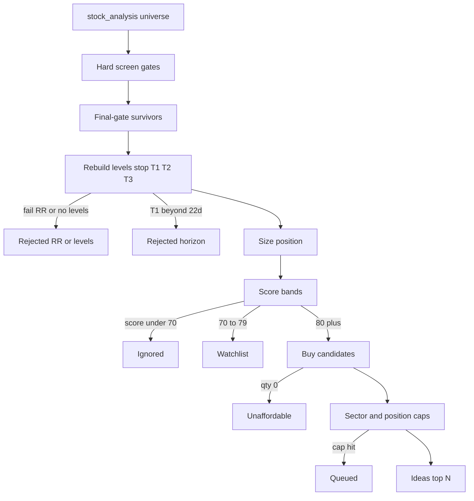

# Universe → idea

How Parkhu turns the day’s `stock_analysis.csv` into **ideas**, **watchlist**, and
**rejects**. Implementation: [`collector/brief/swing_brief.py`](../collector/brief/swing_brief.py).
Thresholds: [`config/risk.py`](../config/risk.py) (all `PARKHU_*` env-overridable).

Operator guide (how to run / read the brief): [`swing-brief.md`](swing-brief.md).
Design rationale for why each gate exists: [`technical-plan.md`](technical-plan.md).
Walk-forward research / OHLC-proxy backtest (Step 1): [`research-backtest.md`](research-backtest.md).



---

## Phase 1 — Hard gates

Applied in order. Fail any → out. These are the desk **Filters** funnel steps.

| # | Gate | Field(s) | Default |
|---|---|---|---|
| 1 | Universe | `cmp` | not null |
| 2 | Trend | `trend_label` | `== "Bullish"` |
| 3 | Long-term trend | `cmp` vs `sma200` | price **>** SMA200 |
| 4 | Medium trend | `cmp` vs `ema50` | price **>** EMA50 |
| 5 | Trend strength | `adx14` | **>** `MIN_ADX` **25** |
| 6 | Momentum band | `rsi14` | **40–80** (`RSI_MIN` / `RSI_MAX`) |
| 7 | Relative strength | `rs_vs_nifty_1m`, `rs_vs_sector_1m` | both **> 0** |
| 8 | Delivery | `delivery_pct` | **≥** `MIN_DELIVERY_PCT` **40** |
| 9 | Volume (if column exists) | `relative_volume` | **≥** `MIN_RELATIVE_VOLUME` **1.0** |
| 10 | Earnings blackout | `earnings_within_21d` | must **not** be true (`EARNINGS_BLACKOUT_DAYS` **21**) |
| 11 | Event risk | `event_risk_score` | **≤** `MAX_EVENT_RISK_SCORE` **1.0** |
| 12 | TV technical rating | `tech_rating` | must **not** contain `"sell"` |

Gate 9 is skipped when `relative_volume` is missing from the frame.

---

## Phase 2 — Levels, R:R, and hold

For each final-gate survivor:

1. Rebuild structure levels (`entry`, `stop`, `t1`–`t3`) via `derive_levels` /
   `structure_trade_levels` (not the CSV’s fixed ladder).
2. Reject if levels are missing or **`rr_t1` < `MIN_RR_T1` (2.0)** →
   *R:R or levels failed MIN_RR_T1*.
3. Reject if **`t1_beyond_mandate`** (estimated hold to T1 **>** `HORIZON_MAX_DAYS` **22**) →
   *T1 needs more than 22 trading days (~1 month)*.
4. Size shares: `qty = min(risk sizing, exposure sizing)`  
   - risk: `RISK_PER_TRADE_PCT` **2%** of `CAPITAL`  
   - exposure: `MAX_POS_PCT` **10%** of `CAPITAL`  
   - default capital: **₹1,00,000**

Stop distance rules used when building levels: stop **>** `MIN_STOP_ATR` (1 ATR),
with config ceilings `MAX_STOP_ATR` / `MAX_STOP_PCT`. Hold estimate is clamped into
`HORIZON_MIN_DAYS`–`HORIZON_MAX_DAYS` (**3–22** trading days) for display; the hard
reject is only when raw T1 days exceed the max.

---

## Phase 3 — Score bands

`parkhu_score` is computed earlier from KB-14-style components. Live weights in
`SCORE_WEIGHTS` (technical, fundamental, earnings, news, institutional, options,
sector, relative_strength, macro). Components with no data are dropped and the rest
**renormalized**; lost weight is reported in the brief under `scoring`.

| Band | Score | Outcome |
|---|---|---|
| Buy | **≥ 80** (`BUY_SCORE`) | idea candidate |
| Watch | **70–79** (`WATCH_SCORE`) | watchlist only (no position) |
| Ignore | **< 70** | `ignored_below_watch` |

---

## Phase 4 — Portfolio → ideas

Only Buy-band names, sorted by score then R:R:

| Check | Parameter | If fail |
|---|---|---|
| Affordability | one share vs 10% name cap | `unaffordable_at_this_capital` |
| Sector concentration | `MAX_SECTOR_PCT` **25%** on `risk_sector` | `queued_on_portfolio_limits` |
| Idea / book size | `min(TOP_N_IDEAS=5, MAX_POSITIONS=10)` | stop picking |

Names that clear all of the above become **ideas**.

Zero ideas is a valid outcome (KB-00): the bar is not lowered to force a recommendation.

---

## Desk mapping

| Desk section | What it shows |
|---|---|
| **Filters** | Phase 1 gates: surviving counts, keep %, top-50 still-in / removed symbols |
| **Survivors** | Final-gate names (top 50 by score) with status `idea` / `watchlist` / `rejected` and reason |
| **Ideas** | Phase 4 picks (levels, no capital sizing on the Pages desk) |

Per-gate symbol samples and survivor outcomes are written to
`output/<date>/funnel_detail.json` and embedded in `swing_brief.json` /
`research_pack.json`. Lists longer than **50** are truncated (ranked by
`parkhu_score`); full counts stay in `surviving` / `dropped_count` /
`survivor_outcomes_total`.

---

## Env overrides

Common knobs (full set in `config/risk.py`):

```bash
PARKHU_CAPITAL=200000
PARKHU_TOP_N_IDEAS=3
PARKHU_MIN_ADX=25
PARKHU_RSI_MIN=40
PARKHU_RSI_MAX=80
PARKHU_MIN_DELIVERY_PCT=40
PARKHU_MIN_RELATIVE_VOLUME=1.0
PARKHU_BUY_SCORE=80
PARKHU_WATCH_SCORE=70
PARKHU_MIN_RR_T1=2
PARKHU_HORIZON_MAX_DAYS=22
PARKHU_MAX_SECTOR_PCT=25
```

Regenerate the brief without a full collect:

```bash
python -c "from collector.brief import swing_brief; print(swing_brief.collect('2026-07-26'))"
```
