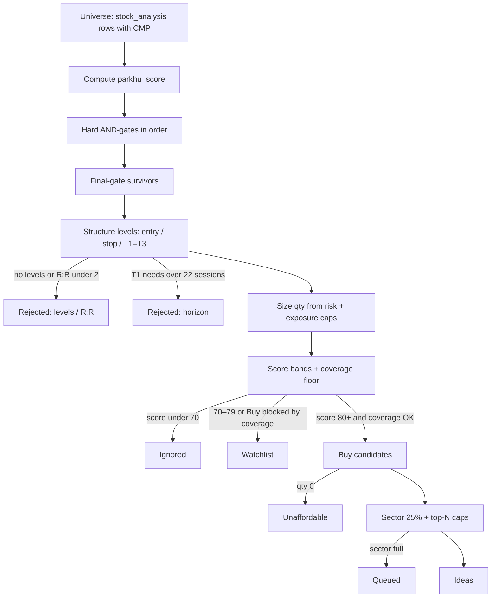

# Universe → idea: how Parkhu picks stocks

This is the **live** selection algorithm: how today’s scanned universe becomes a
short list of swing **ideas** (or zero ideas — that is valid).

| | |
|---|---|
| Code | [`collector/brief/swing_brief.py`](../collector/brief/swing_brief.py) |
| Thresholds | [`config/risk.py`](../config/risk.py) (all `PARKHU_*` overridable) |
| Levels | [`collector/derived/structure_levels.py`](../collector/derived/structure_levels.py) |
| Operator guide | [`swing-brief.md`](swing-brief.md) |
| Why each gate exists | [`technical-plan.md`](technical-plan.md) |
| Research / backtest (not live) | [`research-backtest.md`](research-backtest.md) |
| Live pause bar | [`kill-criterion.md`](kill-criterion.md) |

**Input:** `output/<date>/stock_analysis.csv` (one row per scanned symbol).  
**Output:** `swing_brief.json` / `.md` → packed into `research_pack.json` for the desk.



---

## One-sentence rule

A stock becomes an **idea** only if it passes every hard gate, has valid structure
levels with R:R ≥ 2 and T1 inside ~1 month, scores in the Buy band with enough
score components live, is affordable at the capital book, and fits under sector /
position caps — ranked by score, then R:R. If nothing clears that bar, the brief
ships **zero ideas**.

---

## Step 0 — Universe and score

1. Load `stock_analysis` for the run date.
2. Assign **`risk_sector`** (TradingView sector; Finance split by industry for
   concentration).
3. Build **`parkhu_score`** (0–100) from KB-14-style components that actually have
   data that day:

| Component | Weight | Source (typical) |
|---|---:|---|
| technical | 20 | trend / momentum / delivery / ADX blend |
| fundamental | 15 | `fundamental_score` |
| earnings | 15 | `earnings_score` |
| news | 15 | when present |
| institutional | 10 | when present |
| options | 5 | when present |
| sector | 5 | `sector_score` |
| relative_strength | 5 | when present |
| macro | 5 | when present |

Missing components are **dropped** and the rest **renormalized**. The brief
reports `scoring.live_weights`, `unavailable_components`, and
`weight_unavailable_pct`.

Optional coverage floor (`PARKHU_MIN_SCORE_COMPONENTS`, default **0** = off): if
set (e.g. `7`), Buy-band eligibility requires at least that many live components.
Otherwise a high score built from a thin subset can be demoted to Watch
(`deferred_low_coverage`).

---

## Step 1 — Hard gates (must pass all)

Applied **in order**. Fail any → out of the funnel. Each step records surviving /
dropped counts and top-50 symbol samples (by `parkhu_score`).

| # | Gate | Pass rule | Default |
|---|---|---|---|
| 1 | Universe | `cmp` present | — |
| 2 | Trend | `trend_label == Bullish` | — |
| 3 | Long trend | `cmp > sma200` | — |
| 4 | Medium trend | `cmp > ema50` | — |
| 5 | Trend strength | `adx14 > MIN_ADX` | **25** |
| 6 | Momentum band | `RSI_MIN ≤ rsi14 ≤ RSI_MAX` | **40–80** |
| 7 | Relative strength | `rs_vs_nifty_1m > 0` **and** `rs_vs_sector_1m > 0` | — |
| 8 | Delivery | `delivery_pct ≥ MIN_DELIVERY_PCT` | **40%** |
| 9 | Relative volume | `relative_volume ≥ MIN_RELATIVE_VOLUME` | **1.0** (skipped if column missing) |
| 10 | Earnings blackout | not `earnings_within_21d` | **21** days |
| 11 | Event risk | `event_risk_score ≤ MAX_EVENT_RISK_SCORE` | **1.0** |
| 12 | TV rating | `tech_rating` does **not** contain `"sell"` | — |

Names still in after gate 12 are **final-gate survivors**.

---

## Step 2 — Levels, R:R, horizon, sizing

For each survivor:

1. **Rebuild levels** with `structure_trade_levels` (not a fixed ATR ladder from the CSV):
   - Prefer stop from structure: `base_low` → `swing_low_20d` → `swing_low_50d` → MA below → ATR fallback.
   - Stop distance clamped between `MIN_STOP_ATR` (1×ATR) and
     `min(MAX_STOP_ATR, MAX_STOP_PCT)`.
   - Targets: nearest resistance that clears R:R floor, else R-multiple ladder.
2. **Reject** if levels missing or `rr_t1 < MIN_RR_T1` (**2.0**).
3. **Reject** if `t1_beyond_mandate` — estimated sessions to T1 **>**
   `HORIZON_MAX_DAYS` (**22**, ~1 month).
4. **Size** shares (smaller of the two binds):
   - Risk: `(CAPITAL × RISK_PER_TRADE_PCT%) / (entry − stop)` → default **2%**
   - Exposure: `(CAPITAL × MAX_POS_PCT%) / entry` → default **10%**
   - Default capital: **₹1,00,000**

Hold display is clamped to 3–22 sessions; the hard reject is only the raw T1
horizon check above.

---

## Step 3 — Score bands

Among names that cleared levels:

| Band | Condition | Outcome |
|---|---|---|
| **Buy** | score ≥ **80** *and* coverage OK | idea candidate |
| **Watch** | score ≥ **70**, or Buy blocked by coverage floor | watchlist (no position) |
| **Ignore** | score **&lt; 70** | `ignored_below_watch` |

Sort Buy / Watch pools by **score descending**, then **R:R descending**.

---

## Step 4 — Portfolio → ideas

Walk Buy-band names in that sort order:

| Check | Rule | On fail |
|---|---|---|
| Affordability | `qty ≥ 1` under the 10% name cap | `unaffordable_at_this_capital` |
| Sector cap | running deploy in `risk_sector` ≤ **25%** of capital | `queued_on_portfolio_limits` |
| Book size | stop after `min(TOP_N_IDEAS, MAX_POSITIONS)` → default **5** | remaining Buys not picked |

Names that clear all checks become **`ideas`**. Everything else that survived the
hard gates is explained in **`survivor_outcomes`** (`idea` / `watchlist` /
`rejected` + reason).

---

## What you see on the desk

| Desk | Maps to |
|---|---|
| **Filters** | Step 1 funnel: keep %, top-50 still-in / removed per gate |
| **Survivors** | Final-gate top 50 by score + status / reason |
| **Ideas** | Step 4 picks (levels; Pages desk does not show capital sizing) |
| **Kill pill** | Live ledger pause bar — see [`kill-criterion.md`](kill-criterion.md) |

Artifacts:

- `output/<date>/funnel_detail.json` — per-gate symbol samples  
- `swing_brief.json` / `research_pack.json` — ideas, watchlist, outcomes  

Symbol lists longer than **50** are truncated (ranked by score); full counts stay
in `surviving` / `dropped_count` / `survivor_outcomes_total`.

---

## Worked path (example)

```
RELIANCE in stock_analysis
  → parkhu_score computed (e.g. 84.2)
  → passes gates 1–12 (Bullish, above MAs, ADX/RSI/RS/delivery/…)
  → structure stop under entry, rr_t1 = 2.4, hold_days_t1_raw = 12  ✓
  → sized to 2% risk / 10% exposure
  → Buy band (≥80), coverage OK
  → sector bank under 25%, still room in top-5
  → IDEA
```

A name can look “strong” and still die late: weak R:R, T1 too far, thin score
coverage, unaffordable share price, or sector already full.

---

## Env knobs (common)

```bash
PARKHU_CAPITAL=200000
PARKHU_TOP_N_IDEAS=3
PARKHU_MIN_ADX=25
PARKHU_RSI_MIN=40
PARKHU_RSI_MAX=80
PARKHU_MIN_DELIVERY_PCT=40
PARKHU_MIN_RELATIVE_VOLUME=1.0
PARKHU_BUY_SCORE=80
PARKHU_WATCH_SCORE=70
PARKHU_MIN_SCORE_COMPONENTS=0    # set e.g. 7 to enforce coverage before Buy
PARKHU_MIN_RR_T1=2
PARKHU_HORIZON_MAX_DAYS=22
PARKHU_MAX_SECTOR_PCT=25
```

Rebuild the brief without a full collect:

```bash
python -c "from collector.brief import swing_brief; print(swing_brief.collect('2026-07-26'))"
```

---

## Live vs research

| | Live (this doc) | Research ([`research-backtest.md`](research-backtest.md)) |
|---|---|---|
| Universe | Daily `stock_analysis` | OHLC history + proxy features |
| Gates | All 12 above | OHLC-proxy subset (no delivery / TV rating / earnings PIT) |
| Score | Full `parkhu_score` | `proxy_score` (ADX + RS) |
| Stops / sizing | ATR structure + 2%/10% | Optional GARCH / idio sizing — **not** wired into the brief unless you adopt flags |

Research may recommend demoting gates or raising R:R floors; the live funnel stays
honest until you deliberately change `config/risk.py` / env.
